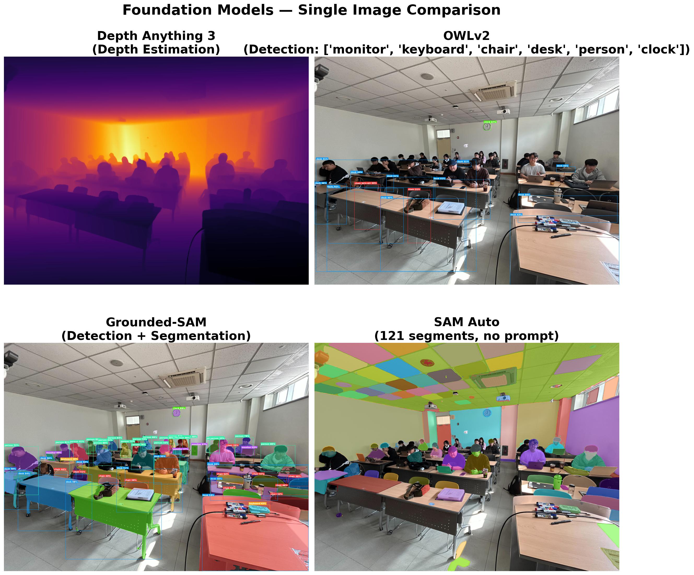
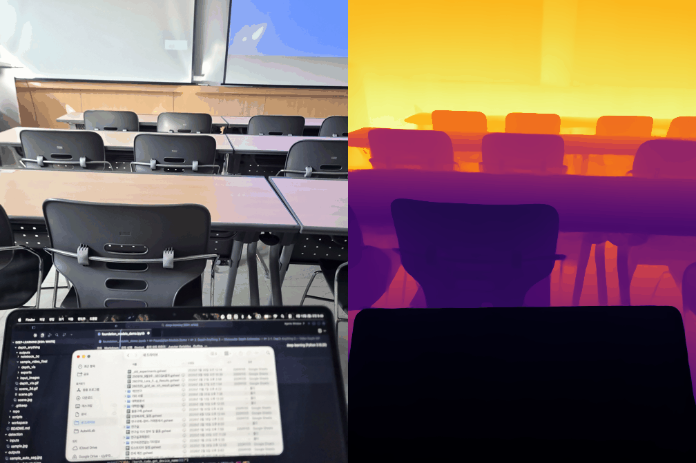
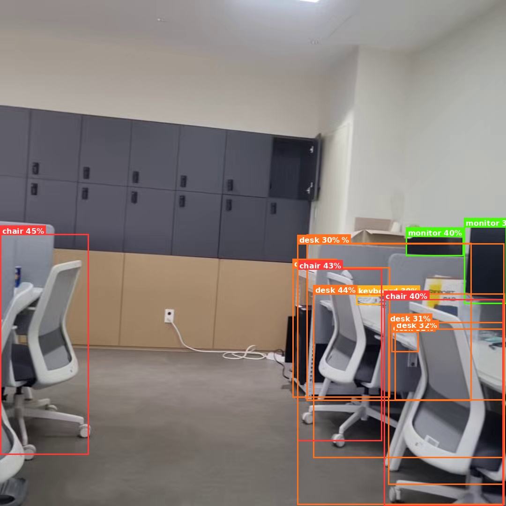
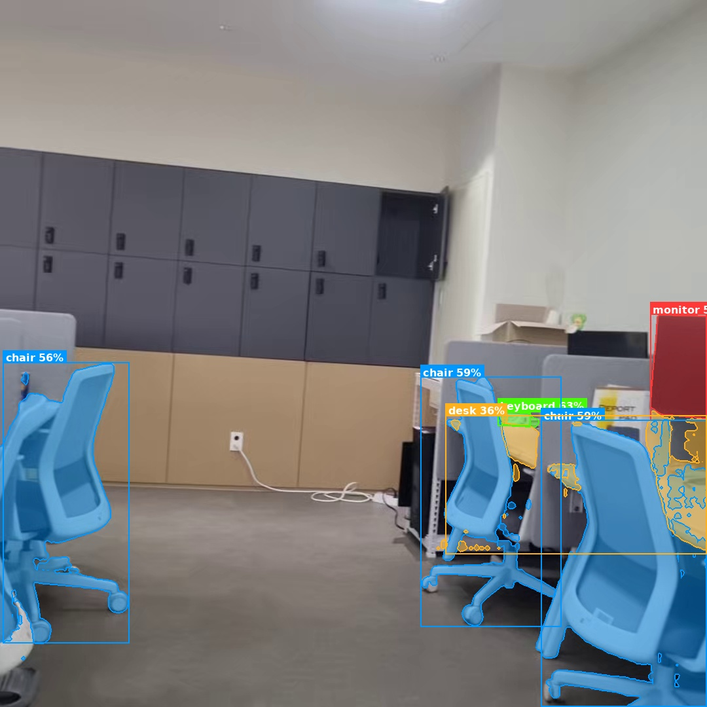
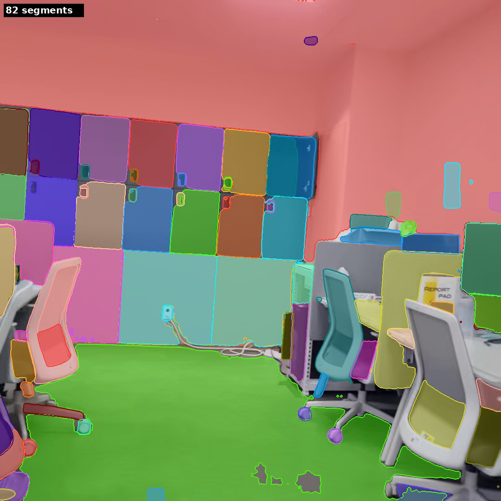

# XAI506 중간 프로젝트 - Vision Foundation Models

세 가지 Vision Foundation Model을 활용한 데모 프로젝트입니다.

| # | Model | Task |
|---|-------|------|
| 1 | **Depth Anything 3** (ByteDance) | 단안 깊이 추정 (Monocular Depth Estimation) |
| 2 | **OWLv2** (Google) | 제로샷 객체 탐지 (Zero-Shot Object Detection) |
| 3 | **Grounding DINO + SAM** (IDEA-Research + Meta) | 텍스트 기반 세그멘테이션 (Text-Prompted Segmentation) |



---

## 프로젝트 구조

```
deep-learning/
├── README.md
├── foundation_models_demo.ipynb      # 세 모델 통합 데모 노트북
├── depth_anything_3d_demo.ipynb      # DA3 3D 포인트 클라우드 데모 노트북
├── foundation_models_summary.jpg     # 결과 요약 이미지
├── depth_anything_video.gif          # 깊이 추정 결과 예시
├── xai506_example_image.jpg          # 입력 예시 이미지
├── examples/                         # 결과 예시 이미지
│   ├── owlv2_detection.jpg
│   ├── grounded_sam_segmentation.jpg
│   └── sam_auto_segmentation.jpg
├── depth_anything/
│   ├── README.md                     # DA3 상세 설치/실행 가이드
│   ├── repo/                         # depth-anything-3 git clone (설치 필요)
│   ├── inputs/                       # 입력 영상
│   ├── outputs/                      # 결과 출력
│   └── scripts/
│       ├── run_video.sh              # DA3 CLI wrapper
│       └── render_gif.py             # 3D 포인트 클라우드 GIF 렌더러
└── detection/
    ├── inputs/                       # 입력 이미지
    ├── outputs/                      # 결과 출력
    └── scripts/
        ├── detect.py                 # OWLv2 이미지 탐지
        ├── detect_video.py           # OWLv2 영상 탐지
        ├── grounded_sam.py           # Grounding DINO + SAM 세그멘테이션
        └── auto_segment.py           # SAM 자동 세그멘테이션
```

---

## 환경 설치 (Installation)

### 요구사항
- **GPU**: CUDA 지원 GPU (VRAM 8GB 이상 권장)
- **Python**: 3.10
- **OS**: Linux (Ubuntu 22.04 테스트됨)

### 1. Conda 환경 생성

```bash
conda create -y -n deep-learning python=3.10
conda activate deep-learning
```

### 2. PyTorch 및 공통 패키지 설치

```bash
# PyTorch (CUDA 버전에 맞게 설치)
pip install "torch>=2" torchvision xformers

# 공통 의존 패키지
pip install transformers pillow scipy imageio opencv-python matplotlib numpy trimesh huggingface_hub
```

### 3. Depth Anything 3 설치

```bash
cd depth_anything
git clone https://github.com/ByteDance-Seed/depth-anything-3.git repo
cd repo
pip install -e ".[app]"
cd ../..
```

> 자세한 내용은 [depth_anything/README.md](depth_anything/README.md) 참고

### 4. 설치 확인

```bash
conda activate deep-learning
python -c "import torch; print('CUDA:', torch.cuda.is_available())"
python -c "from transformers import Owlv2Processor; print('OWLv2 OK')"
da3 --help
```

---

## 코드 설명

### 1. Depth Anything 3 - 단안 깊이 추정

**모델:** `depth-anything/DA3-LARGE-1.1` (0.35B params, ByteDance-Seed)

입력 영상에서 프레임별 깊이(depth) 맵을 추정하고, 3D 포인트 클라우드를 생성합니다.

| 항목 | 설명 |
|------|------|
| **입력** | 영상 파일 (.mp4) |
| **출력** | 깊이 맵 시각화, 3D 포인트 클라우드 (.glb), GIF 애니메이션 |
| **스크립트** | `depth_anything/scripts/run_video.sh`, `depth_anything/scripts/render_gif.py` |

**실행 방법:**

```bash
cd depth_anything

# 영상에서 깊이 추정 실행
./scripts/run_video.sh inputs/<video>.mp4

# 3D 포인트 클라우드 GIF 렌더링
python scripts/render_gif.py outputs/<video>_final
```

**결과 예시:**



> 첫 실행 시 HuggingFace Hub에서 모델 가중치를 자동 다운로드합니다 (수 GB).

---

### 2. OWLv2 - 제로샷 객체 탐지

**모델:** `google/owlv2-base-patch16-ensemble` (CLIP 기반, Google)

텍스트 쿼리만으로 이미지에서 객체를 탐지합니다. 사전 학습된 카테고리 없이 자유로운 텍스트 프롬프트를 사용할 수 있습니다.

| 항목 | 설명 |
|------|------|
| **입력** | 이미지 파일 + 텍스트 쿼리 (쉼표 구분) |
| **출력** | 바운딩 박스와 confidence score가 표시된 이미지 |
| **스크립트** | `detection/scripts/detect.py`, `detection/scripts/detect_video.py` |

**실행 방법:**

```bash
cd detection

# 이미지 탐지
python scripts/detect.py inputs/sample.jpg "monitor, keyboard, mouse"

# 영상 탐지
python scripts/detect_video.py inputs/sample.mp4 "person, car" --fps 5

# 옵션
#   --threshold 0.3    confidence 임계값 (기본 0.3)
#   --model base|large 모델 크기 선택
```

**결과 예시:**



---

### 3. Grounding DINO + SAM - 텍스트 기반 세그멘테이션

**모델:**
- **Grounding DINO** (`IDEA-Research/grounding-dino-tiny`) — 텍스트 → 바운딩 박스
- **SAM** (`facebook/sam-vit-base`) — 바운딩 박스 → 세그멘테이션 마스크

두 모델을 파이프라인으로 연결하여, 텍스트 프롬프트로 지정한 객체의 정밀한 세그멘테이션 마스크를 생성합니다.

| 항목 | 설명 |
|------|------|
| **입력** | 이미지 파일 + 텍스트 쿼리 (마침표 구분) |
| **출력** | 컬러 세그멘테이션 마스크가 오버레이된 이미지 |
| **스크립트** | `detection/scripts/grounded_sam.py`, `detection/scripts/auto_segment.py` |

**실행 방법:**

```bash
cd detection

# 텍스트 기반 세그멘테이션
python scripts/grounded_sam.py inputs/sample.jpg "monitor. keyboard. chair."

# 프롬프트 없는 자동 세그멘테이션 (SAM Auto)
python scripts/auto_segment.py inputs/sample.jpg

# 옵션
#   --dino-model tiny|base    Grounding DINO 모델 크기
#   --sam-model sam-base|sam-large|sam-huge|sam2  SAM 모델 선택
#   --threshold 0.3           confidence 임계값
```

**결과 예시:**

| Grounded-SAM (텍스트 프롬프트) | SAM Auto (자동 세그멘테이션) |
|:---:|:---:|
|  |  |

---

## 노트북 (Notebooks)

| 노트북 | 설명 |
|--------|------|
| `foundation_models_demo.ipynb` | 세 가지 모델을 순차적으로 실행하는 **통합 데모**. 이미지/영상 입력 → 깊이 추정 → 객체 탐지 → 세그멘테이션 |
| `depth_anything_3d_demo.ipynb` | Depth Anything 3의 **3D 포인트 클라우드 생성** 데모. 카메라 파라미터를 이용한 역투영(back-projection) |

> 노트북에는 실행 결과(출력 이미지)가 포함되어 있어 실행 없이도 결과를 확인할 수 있습니다.

---

## 참고사항

- GPU (CUDA) 환경이 필수입니다.
- 최초 실행 시 HuggingFace Hub에서 모델 가중치가 자동 다운로드됩니다.
- 필요 VRAM: DA3-LARGE 기준 8GB 이상 권장
- `depth_anything/repo/` 디렉토리는 별도 `git clone`이 필요합니다 (설치 가이드 참조).

---

## English Summary

This project demonstrates three **Vision Foundation Models** for the XAI506 midterm:

1. **Depth Anything 3** (ByteDance-Seed) — Monocular depth estimation from video. Generates per-frame depth maps and 3D point clouds.
2. **OWLv2** (Google) — Zero-shot object detection using free-form text queries. No predefined categories needed.
3. **Grounding DINO + SAM** (IDEA-Research + Meta) — Text-prompted semantic segmentation. Combines text-to-box detection with pixel-level mask generation.

### Quick Start

```bash
# 1. Create conda environment
conda create -y -n deep-learning python=3.10 && conda activate deep-learning

# 2. Install dependencies
pip install "torch>=2" torchvision xformers
pip install transformers pillow scipy imageio opencv-python matplotlib numpy trimesh huggingface_hub

# 3. Install Depth Anything 3
cd depth_anything && git clone https://github.com/ByteDance-Seed/depth-anything-3.git repo
cd repo && pip install -e ".[app]" && cd ../..

# 4. Run examples
cd detection
python scripts/detect.py inputs/sample.jpg "monitor, keyboard, mouse"
python scripts/grounded_sam.py inputs/sample.jpg "monitor. keyboard. chair."
python scripts/auto_segment.py inputs/sample.jpg
```

Refer to each section above for detailed input/output descriptions and example results.
